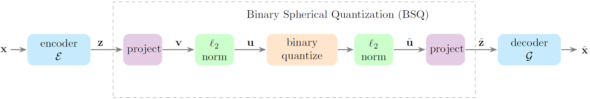
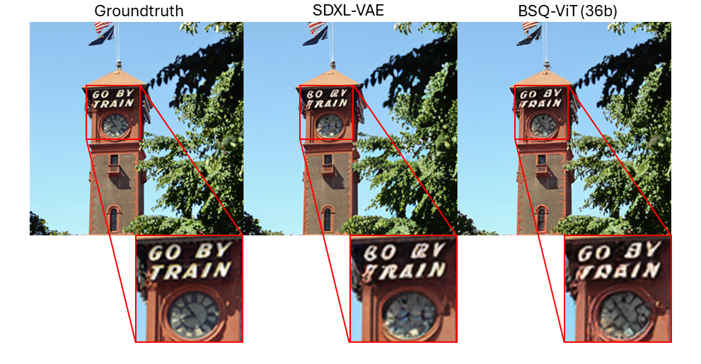
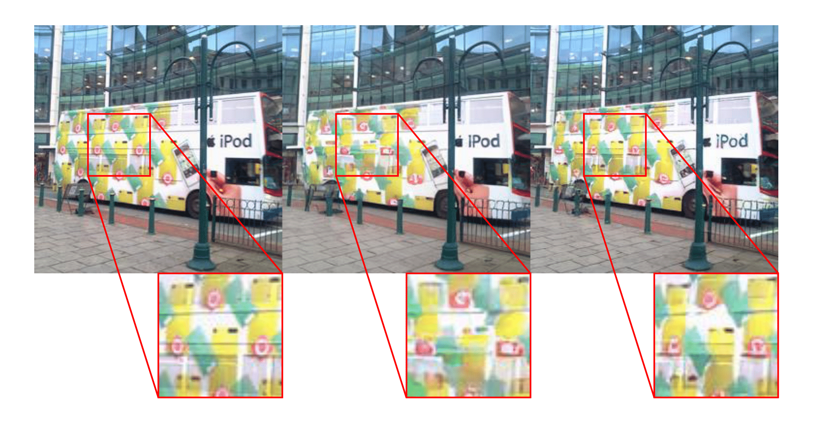
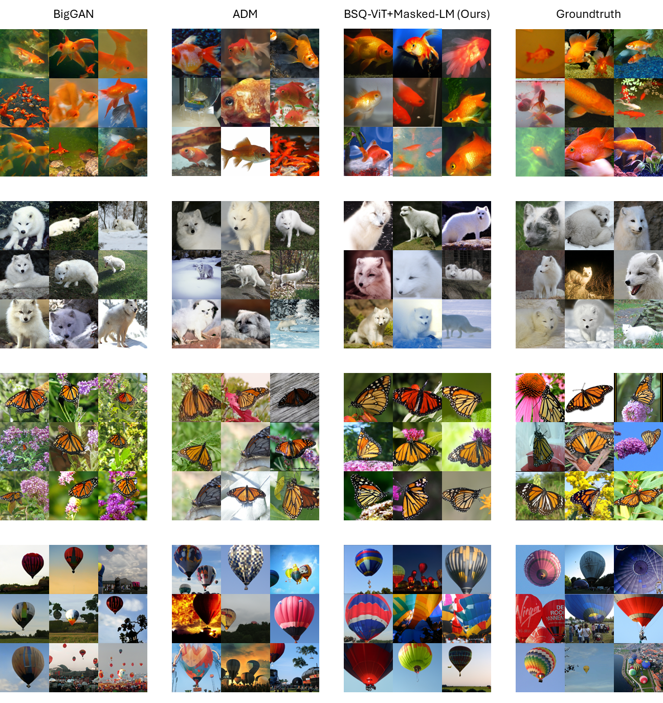
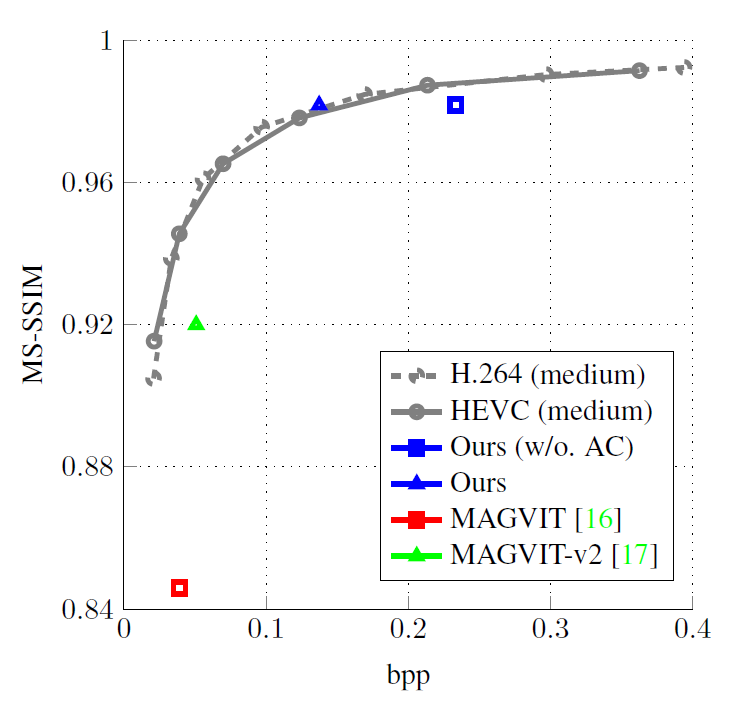

# 🍰 BSQ-ViT

You can pronouce BSQ-ViT like "biskvit" (a kind of [Russian sponge cake](https://natashaskitchen.com/biskvit-russian-cake-recipe/)) or simply "biscuit".


[**Image and Video Tokenization with Binary Spherical Quantization**](http://arxiv.org/abs/2406.07548)  
Yue Zhao<sup>1</sup>, Yuanjun Xiong<sup>2</sup>, Philipp Kr&auml;henb&uuml;hl<sup>1</sup>  
<sup>1</sup> UT Austin, <sup>2</sup>Predera  
[arxiv](http://arxiv.org/abs/2406.07548) | [bibtex](#citing-bsq-vit) 



## Installation

1. Install [Miniforge3](https://github.com/conda-forge/miniforge)

2. Create the environment

```bash
mamba env create -f bsqvit-env.yaml
mamba activate bsqvit
```

## Main Results

### Image Reconstruction (IN-1K val 256x256)

|                                                         |  Use approx. (Eq 8)  | #bits | PSNR<sub>↑</sub> | SSIM<sub>↑</sub> | LPIPS<sub>↓</sub> | rFID<sub>↓</sub> | config & ckpt | md5sum |
| ------------------------------------------------------- | -------------------- | ----- | ---------------- | ---------------- | ----------------- | ---------------- | ------------- | ------ |
| [SDXL-VAE](https://huggingface.co/stabilityai/sdxl-vae) |       N/A            |  64   |      25.38       |      .7276       |       .0666       |      0.72        | [External](https://huggingface.co/stabilityai/sdxl-vae)                         | N/A    |
| BSQ-ViT                                                 |                      |  18   |      24.79       |      .7319       |       .0836       |      1.34        | [UTBox](https://utexas.box.com/s/k5249jg1c6iznslsl89lwqqg6woqg27o) | 7abf5a |
| BSQ-ViT (EMA)                                           |                      |  18   |      24.80       |      .7314       |       .0820       |      1.23        | [UTBox](https://utexas.box.com/s/k5249jg1c6iznslsl89lwqqg6woqg27o) | 7abf5a |
| BSQ-ViT                                                 |       &check;        |  18   |      25.36       |      .7578       |       .0761       |      1.14        | [UTBox](https://utexas.box.com/s/nt9g741b1cu4nidygd3a3e26clpemr0n) | 8f5422 |
| BSQ-ViT (EMA)                                           |       &check;        |  18   |      25.80       |      .7680       |       .0729       |      1.30        | [UTBox](https://utexas.box.com/s/nt9g741b1cu4nidygd3a3e26clpemr0n) | 8f5422 |
| BSQ-ViT                                                 |       &check;        |  36   |      27.88       |      .8410       |       .0432       |      0.41        | [UTBox](https://utexas.box.com/s/a7w3lw5q4dzxun3ai9uthhc3y8ade0pw) | b5ce5f |
| BSQ-ViT (EMA)                                           |       &check;        |  36   |      28.14       |      .8448       |       .0400       |      0.45        | [UTBox](https://utexas.box.com/s/a7w3lw5q4dzxun3ai9uthhc3y8ade0pw) | b5ce5f |




### Video Reconstruction (UCF-101 16x128x128)

|                   | #bits | PSNR<sub>↑</sub> | SSIM<sub>↑</sub> | LPIPS<sub>↓</sub> | rFVD<sub>↓</sub> | config & ckpt |
| ----------------- | ----- | ---------------- | ---------------- | ----------------- | ---------------- | ------------- |
| MAGVIT-L          |  10   |      22.0        |      .7010       |       .0990       |     25           |   N/A         |
| MAGVITv2          |  18   |        -         |      -           |       .0694       |     16.12        |   N/A         |
| MAGVITv2 (deeper) |  18   |        -         |      -           |       .0537       |      8.62        |   N/A         |
| BSQ-bcViT         |  18   |      32.08       |      .9421       |       .0244       |      8.08        |   [TBA]()     |
| BSQ-bcViT         |  36   |      33.80       |      .9606       |       .0159       |      4.10        |   [TBA]()     |


### Image Synthesis (IN-1K 128x128)

|                          | FID<sub>↓</sub> | IS<sub>↑</sub> | Prec<sub>↑</sub> | Rec<sub>↑</sub> | pre-computed samples                                                          | config & ckpt | 
| ------------------------ | --------------- | -------------- | ---------------- | --------------- | ----------------------------------------------------------------------------- | ------------- |
| BigGAN                   |    6.02         |     145.8      |     0.86         |    0.35         |  [External](https://github.com/openai/guided-diffusion/tree/main/evaluations) | [External](https://github.com/ajbrock/BigGAN-PyTorch)  |
| ADM                      |    5.91         |      93.3      |     0.70         |    0.65         |  [External](https://github.com/openai/guided-diffusion/tree/main/evaluations) | [External](https://github.com/openai/guided-diffusion) |
| Ours BSQ-ViT + Masked-LM |    5.44         |     139.6      |     0.80         |    0.50         |  [UTBox](https://utexas.box.com/s/ivyrdyeinpe62rbeaxg7knggrprsgh3b)           | [TBA]()       | 




### Video Compression (MCL-JCV 360P)




## License

[MIT License](./LICENSE).


# Citing BSQ-ViT
```bibtex
@article{zhao2024bsqvit,
  title={Image and Video Tokenization with Binary Spherical Quantization},
  author={Zhao, Yue and Xiong, Yuanjun, and Kr{\"a}henb{\"u}hl, Philipp},
  journal={arXiv preprint arXiv:2406.07548},
  year={2024}
}
```
